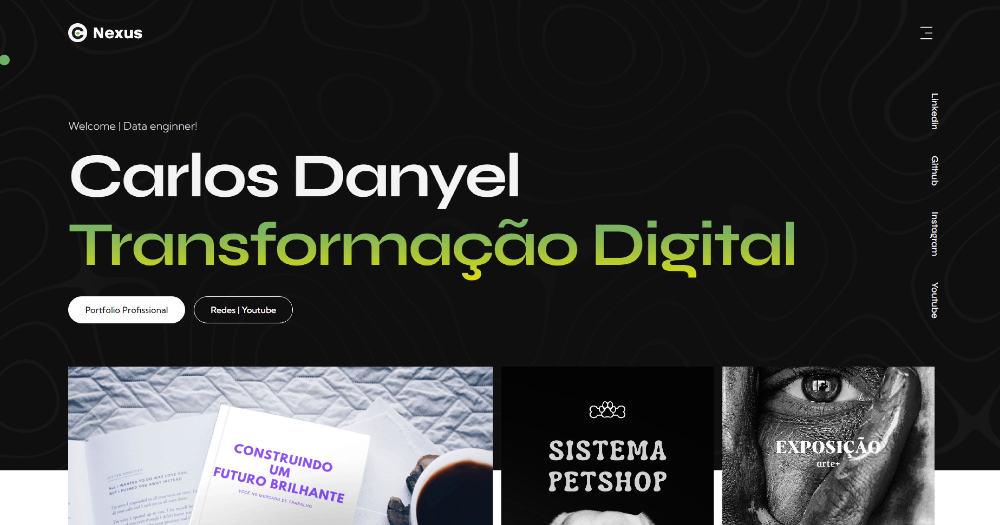

<h1 align="center">
  🖥️ ​ Portfolio Profissional
</h1>

## 🌟 Sobre

Bem-vindo ao template de portfolio para devs, um espaço dedicado à apresentação dos meus projetos e uma visão detalhada sobre quem sou e no que trabalho.

---

## 📚 Seções

O site é composto por seis seções:

-   **Home:** Explore a página inicial para ter uma visão geral do meu trabalho e das últimas atualizações.
-   **Projetis** Aqui, você encontrará uma coleção dos meus projetos anteriores e atuais, abrangendo diversas áreas e habilidades.
-   **Sobre** Na seção "Sobre", compartilho informações sobre minha trajetória profissional, minhas habilidades e minha paixão por criar soluções inovadoras.
-   **Projetos Recentes:** Fique por dentro dos meus projetos mais recentes e descubra o que estou trabalhando atualmente.
-   **Tecnologia:** Explore as tecnologias e ferramentas que utilizo em meus projetos e que fazem parte do meu repertório técnico.
-   **Contato:** Entre em contato comigo para discutir oportunidades de colaboração, projetos futuros ou simplesmente para trocar ideias e experiências.

---

## 💼 Tecnologias utilizadas

Para o desenvolvimento deste site utilizei as seguintes tecnologias:

-   React;
-   Sass/Scss;
-   React-scroll;
-   SwiperJs;
-   GrainedJs;
-   FremerMotion;
-   React router dom;

---

<h2>Desenvolvedor</h2>

<table>
  <tr>
    <td align="center">
      
Carlos Danyel Silva Teixeira

    </td>
  </tr>
</table>
